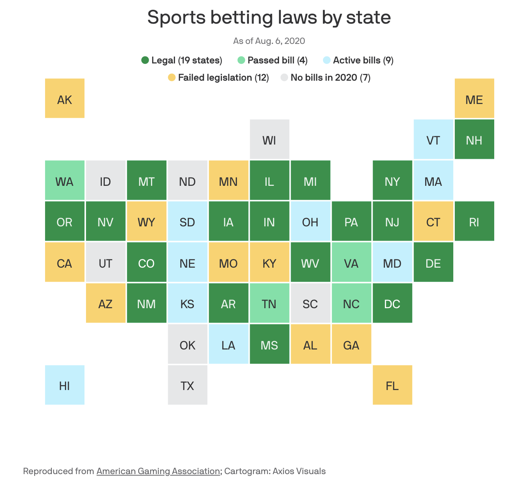

# Pick'em Predictions: An Algorithm For Wins & Losses

## Introduction

Although picking wins and losses for money in sports is an age-old tradition, it's quickly becoming a giant industry. According to the American Gaming Association 150$ billion is wagered on sports annually and 95$ billion of that is spent on the NFL & college football. In fact, 6$ billion was wagered on the 2019 super bowl alone. Over the years sports betting in the US has been a controversial subject and has often been down in an "under-the-table" manner but more and more states are approving both in person and online sports gambling. Though there is always a moral argument to be made, it's undeniable that people are intersted in wagering their hard-earned dollars on sports.

That's where we come in. We set out to create an algorithm that would give you and edge on the Vegas odds line and we have delivered. In a time where sports are a refuge for so many stuck in their homes, whether you're betting against Vegas or close friends, our algorithm will help you come out on top.

## Navigating the Repo:

1. Tools:
    a. Date_Grabber:[Notebook](https://github.com/carlyf15/Pickem_Predictions/blob/master/Date_Grabber.ipynb) Function which grabs game dates.
    b. Raw_Data_SQL:[Notebook](https://github.com/carlyf15/Pickem_Predictions/blob/master/Raw_Data_SQL.ipynb) Function which inputs raw data into SQL table.
    c. Engineered_Data_SQL: [Notebook](https://github.com/carlyf15/Pickem_Predictions/blob/master/Engineered_Data_SQL.ipynb) Function whic inputs engineered data into SQL table.

2. Files:
    a. final_model.h5: Final model weights.
    b. final_model.json: Final algorithm model.
    c. NFL_Modeling_Stats.db: SQL file holding engineered data
    d. NFL_Stats.db: SQL file holding raw data
    e. nfl_stats_2018/2019/2020.csv: csv holding raw data in pandas dataframe

4. Data Aquisition:
    a. 2018_Stats: [Notebook](https://github.com/carlyf15/Pickem_Predictions/blob/master/2018_Stats.ipynb) Function scraping raw data into pandas dataframes
    b. 2019_Stats: [Notebook](https://github.com/carlyf15/Pickem_Predictions/blob/master/2019_Stats.ipynb) Function scraping raw data into pandas dataframes
    c. 2020_Stats: [Notebook](https://github.com/carlyf15/Pickem_Predictions/blob/master/2020_Stats.ipynb) Function scraping raw data into pandas dataframes

3. Analysis:
    a. EDA_2019: [Notebook](https://github.com/carlyf15/Pickem_Predictions/blob/master/EDA_2019.ipynb) Extensive analysis of 2019 NFL season.

4. Modeling & Predictions:
    a. Modeling: [Notebook](https://github.com/carlyf15/Pickem_Predictions/blob/master/Modeling.ipynb) Modeling data into final algorithm.
    b. Final_Predictions: [Notebook](https://github.com/carlyf15/Pickem_Predictions/blob/master/Final_Predictions.ipynb) Function which uses final model to make live predictions.

5. Presentation:
    a. Presentation: [Notenook](https://github.com/carlyf15/Pickem_Predictions/blob/master/presentation.pdf) Slide deck

## Methodology

#### The Dataset:

The dataset was derived by web scraping datapoints from https://www.footballdb.com/ and then custom engineered into a pandas dataframe & SQL table for further manipulation.

#### Modeling:

A neural network was used to create the final algorithm used to predict wins and losses. The final predictions utilize a baseline framework neural network with custom feature selection (using boruta) for each custom prediction.

## Results

The baseline model achieved 74% accuracy and the custom-game model achieves consistently 74-76% accuracy, improving picking accuracy by 24-26%.

## Conclusions

The factors leading to wins and losses are elusive and difficult to identify in a single or set of statistics. Our model improves the odds of making a winning choice by 24-26%, a significant leg up to winning your bet or the ever sought after bragging rights. Happy Picking!

## Limitations & Improvements:

This dataset is incredibly extensive but does lack certain aspects that may improve it's accuracy and relavance. It would be potentially helpful to include both offensive and defensive schemes, roster specific data, coach specific data, and injury specific data. It might also be prudent to create an algorithm that will return not just win/loss probabilities but also potential scores to assist with picking against the spread.

